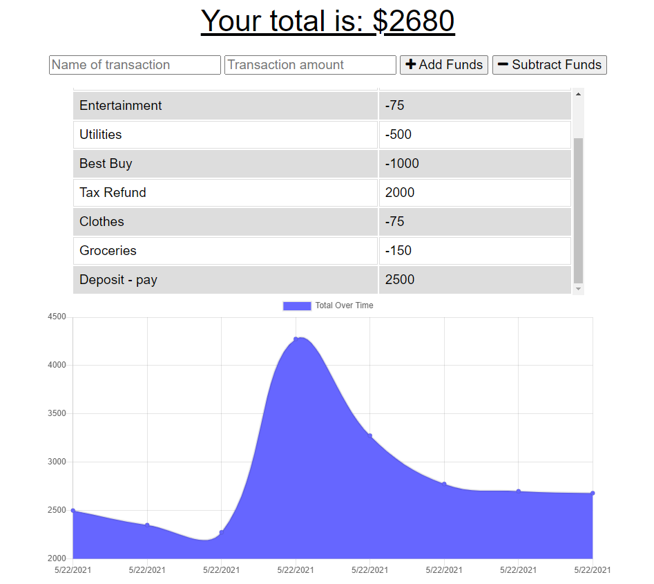

# PWA_Budget_Tracker

## PWA Online/Offline Budget Tracker

## Description

Use the budget tracker to meet your financial goals from anywhere - whether you are online or offline. All offline transactions will be stored in your local cache, and when you are back online, they will be added to the database, so you don't need to worry about losing your transactions while out and about.

---

## Installation

In order to use the Budget Tracker application, you will need to follow the following steps:

1. Use Command Prompt or the VS terminal to install the needed npm node packags:
   - Run 'npm install' to pull down the npm package manager.
   - Make sure you have MongoDB and Mongoose installed.
2. Run 'npm start' in either the command prompt or VS terminal.
3. Navigate to the localhost to view and test application.

---

## Usage

This program can be used with permission.\
Go to the Heroku deployment:
[Budget Tracker](https://murmuring-waters-92136.herokuapp.com/)

---

## License

---

## Contact

If you have any questions, please contact me at:\
✉️[Email](mailto:hrkoren@gmail.com)\
📂[GitHub](https://github.com/hrkoren)
